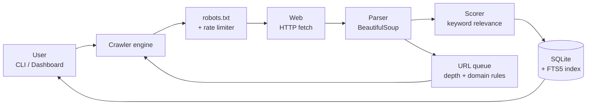
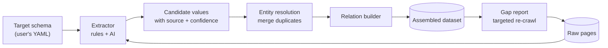
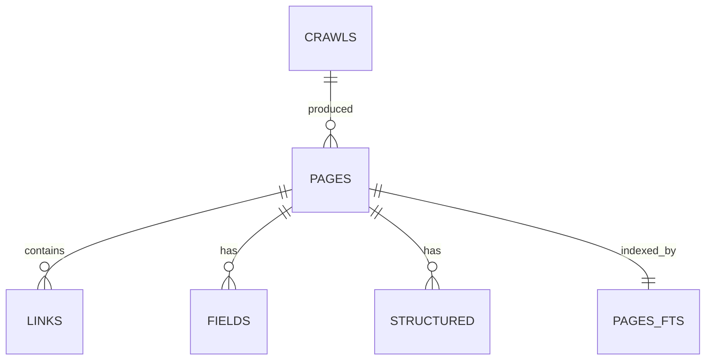
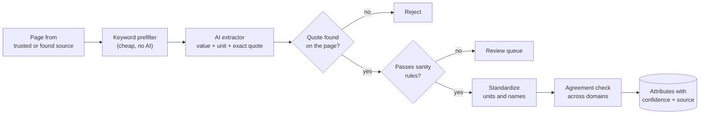
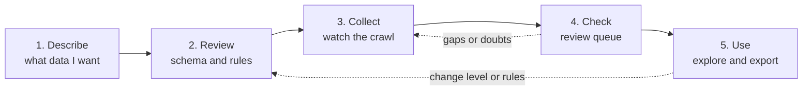
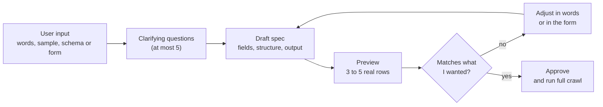

# Project Spider — Requirements & Design Document

2026-09-20 · @Someone

## 1. Overview

Project Spider is a project-local web crawler: a developer runs it inside their project folder, tells it what to look for, and it collects pages from across the web into a structured, searchable database that stays with the project.

**Problem.** The data a project needs usually does not exist on the internet in one ready-made place. The facts are scattered across many sites, each with a different format, and the useful part is the *combination or relation* between them (for example a plant, where it grows, what it is used for, and who studies it). Builders end up assembling that dataset by hand, which takes days of searching, copying and cross-checking.

**Vision.** A tool that behaves like git or Claude Code: `spider init` once per project, then ask for data whenever it is needed and read it back instantly, offline, from a local database.

**One-line pitch.** "You describe the dataset you wish existed; Spider roams the web, gathers the scattered pieces, links them together, and builds it for you as a clean database with the source of every value."

*Open question: the hackathon name, theme and judging criteria are not yet fixed. The scope below is written to fit a 24 to 48 hour build and should be adjusted once the theme is known.*

## 2. Goals, non-goals and MVP scope

The hackathon MVP must crawl real sites by topic, store results in a local database, and let a user search and export them within one command each.

**Goals**

- Crawl from seed URLs across many sites, following links to a chosen depth.
- Save only pages relevant to user-supplied keywords, while still following their links.
- Store pages in a normalised SQLite database with full-text search.
- Let users define custom fields (for example price or name) using CSS selectors.
- Read data back through search, get, export (CSV, JSON) and raw SQL.
- Respect robots.txt and rate limits by default.

**Non-goals (for the hackathon)**

- Running JavaScript-heavy pages (headless browser rendering).
- Distributed crawling or crawling millions of pages.
- Bypassing logins, paywalls or anti-bot protection.
- A hosted multi-user service.

**Scope tiers**

| Tier | Feature | Status |
| --- | --- | --- |
| MVP | CLI basics: init, crawl, search, get, export, sql, stats | Built (prototype) |
| MVP | Keyword relevance filter, robots.txt, per-domain delay, custom CSS fields | Built (prototype) |
| Core | `spider.yaml` project file with `check`, `build`, `report` (section 11) | Planned |
| Core | Reference database and `ref` commands (units, places, categories, aliases) | Planned |
| Core | Standardization engine and conflict rules (D9) | Planned |
| Core | Entity merging, relations, provenance and trust score (D2) | Planned |
| Core | User-specified derivations plus suggested derivations (D7) | Planned |
| Core | Normalization modes: project mode at 3NF or higher, analysis mode from 0NF (D8) | Planned |
| Core | Local-name and multilingual matching for the demo domain (D4) | Planned |
| Stretch | BCNF, 4NF, 5NF and 6NF output with automatic checks (D8) | Planned |
| Stretch | Describe-to-schema and gap-driven `fill` (D1, D3) | Planned |
| Stretch | Web dashboard, dataset pack, self-healing extractors (D5, D6) | Planned |

## 3. Users and use cases

The primary user is a student or developer building a data-driven project who needs topic-specific web data without writing a new scraper each time.

| Persona | Need | Example |
| --- | --- | --- |
| Student builder | Gather facts on a topic for a project or app | Collect Himalayan plant descriptions from botany and government sites |
| App developer | Fill an app's database with real content | Gather public transport routes and tourist places for a trip planner |
| Researcher | Build a searchable corpus on a subject | Crawl news and papers on a policy topic, then search offline |

**Core user stories**

1. As a user, I run `spider init` in my project so my data lives beside my code.
2. As a user, I give seed links and keywords so only relevant pages are saved.
3. As a user, I add `-e price=.price` so structured values are captured per page.
4. As a user, I search my stored data later without re-crawling or needing internet.
5. As a user, I export results to CSV or JSON to feed my app or a spreadsheet.

## 4. Functional requirements

There are 14 functional requirements; P0 must work for the demo, P1 is strongly wanted, P2 is stretch.

| ID | Requirement | Priority |
| --- | --- | --- |
| FR-1 | `init` creates a `.spider/spider.db` database in the current project folder and is found from sub-folders | P0 |
| FR-2 | `crawl` accepts one or more seed URLs and traverses links breadth-first | P0 |
| FR-3 | Crawl limits: depth (`-d`), maximum pages (`-n`), per-domain delay (`--delay`) | P0 |
| FR-4 | Keyword filter (`-k`): save a page only if its relevance score is above zero, but still follow its links | P0 |
| FR-5 | Domain control: stay on seed domains by default; `--any-domain` and `--domains` widen it | P0 |
| FR-6 | Extract per page: title, description, author, published date, language, headings, cleaned text, word count | P0 |
| FR-7 | Custom extraction rules `-e name=CSS` stored as name/value rows | P0 |
| FR-8 | Capture embedded JSON-LD (schema.org) blocks as structured data | P1 |
| FR-9 | Full-text search with ranked results and highlighted snippets | P0 |
| FR-10 | `get`, `export` (text, JSON, CSV) and read-only `sql` commands | P0 |
| FR-11 | Skip already-stored URLs; `--refresh` re-fetches them; content hash recorded for change detection | P1 |
| FR-12 | Record every crawl run (seeds, keywords, limits, pages saved) | P1 |
| FR-13 | Local web dashboard to start crawls and browse, filter and download results | P2 |
| FR-14 | Seed discovery from a text query and AI-generated page summaries | P2 |

**Data assembly requirements (the core differentiator).** These turn Spider from a page collector into a builder of combined datasets.

| ID | Requirement | Priority |
| --- | --- | --- |
| FR-15 | User defines a target schema: the tables, columns and relations of the dataset they want (for example plants, regions, uses), in a small YAML file | P0 |
| FR-16 | Extraction fills the schema from each crawled page using rules (CSS or regex) and, where rules fail, an AI extractor that returns values in the schema's shape | P0 |
| FR-17 | Entity resolution: the same real-world item found on different sites ("Brahmakamal", "Saussurea obvallata") is merged into one record | P0 |
| FR-18 | Relation building: values found together on a page or across pages create links between records (plant to region, plant to use) | P0 |
| FR-19 | Provenance: every value stores its source URL, fetch time and a confidence score; conflicting values from different sources are kept and flagged | P0 |
| FR-20 | Gap report: shows which schema cells are still empty and lets the user run a targeted crawl to fill them | P1 |
| FR-21 | Export the assembled dataset as related CSV files or a ready SQLite database for the user's app | P0 |

**Requirements added by the differentiating features** (section 10 explains each in detail).

| ID | Requirement | Priority |
| --- | --- | --- |
| FR-22 | Derived fields are defined by the user (method, inputs, unit, `if_missing`, explanation, review flag) and store their formula and lineage | P0 |
| FR-23 | Normalization modes: project mode stores at 3NF or higher; analysis mode allows 0NF to 6NF; each output is checked against its level | P0 (3NF and analysis flat), P1 (BCNF to 6NF) |
| FR-24 | Standardization engine converts units, dates, currency, places, names, categories and identifiers before merging, with user-chosen conflict rules | P0 |
| FR-25 | After a build, the system suggests derivations for empty fields; the user approves, edits or rejects; policy is `suggest`, `auto_safe` or `off`; AI-proposed formulas always need approval | P1 |
| FR-26 | A reference database of units, places, categories, aliases, authority IDs and source ranking, with `ref load / list / edit` | P0 |
| FR-27 | Project file `spider.yaml` with commands `describe`, `check`, `build`, `report`, `fill`, `derive` and `explain` | P0 for check, build and report; P1 for the rest |
| FR-28 | Standardization report and cell-level lineage from any value back to its source pages | P1 |

## 5. Non-functional requirements, ethics and legal constraints

Spider must be polite to websites, simple to install, and fast enough to demo live.

| ID | Category | Requirement |
| --- | --- | --- |
| NFR-1 | Politeness | Obey robots.txt and Crawl-delay; default 1 second between requests to one domain; identify itself with a clear User-Agent |
| NFR-2 | Performance | Search over 10,000 stored pages returns in under 1 second; crawl throughput bounded only by politeness delay |
| NFR-3 | Portability | Runs on macOS, Linux and Windows with Python 3.9+; only two dependencies (requests, beautifulsoup4) |
| NFR-4 | Reliability | A failed page or timeout never stops a crawl; data is committed after every saved page so an interrupted crawl loses nothing |
| NFR-5 | Privacy | All data stays on the user's machine; no telemetry; no personal data collected on purpose |
| NFR-6 | Usability | A new user reaches first results in under 5 minutes using the README |
| NFR-7 | Safety | Raw SQL command is for reading data; the tool never deletes or modifies pages outside its own crawl logic |

**Ethical and legal notes.** Users are responsible for crawling only sites that permit it and for respecting each site's terms of service and copyright. Spider will not bypass logins, paywalls or CAPTCHAs, and stored text should be used for analysis and citation rather than republished wholesale. Pages that may contain personal information should be excluded from the dataset.

## 6. System architecture and crawl pipeline

Spider is a single-process Python application with three layers: an interface (CLI now, dashboard later), a crawler engine, and a SQLite store.



The diagram reads left to right: a request passes politeness checks, is fetched and parsed, scored for relevance and stored, while its links feed back into the queue.

**Crawl pipeline, per URL**

1. Pop the next URL and depth from a first-in-first-out queue (breadth-first).
2. Skip it if already stored (unless `--refresh`) or disallowed by robots.txt.
3. Wait until the domain's delay has passed, then fetch with a 15 second timeout.
4. Accept only HTTP 200 responses with an HTML content type.
5. Parse metadata, headings, JSON-LD, links and custom CSS fields, then strip scripts, navigation and footers to get clean text.
6. Score relevance: for each keyword, up to 10 counted occurrences in the text plus 5 if it appears in the title.
7. If the score is above zero (or no keywords were given), save the page, its links, fields and structured data, and update the search index.
8. If depth is below the limit, queue unseen links that pass the domain rules.
9. Stop when the queue is empty or the page limit is reached.

**Assembly layer (added on top of the pipeline).** After pages are stored, a second stage builds the user's dataset from them.



The loop closes at the right: empty cells in the assembled dataset tell the crawler what to look for next.

Example schema for a Himalayan plants project:

```yaml
entities:
  plant:   [common_name, scientific_name, altitude_m, flowering_season]
  region:  [name, state]
  use:     [description]
relations:
  - plant grows_in region
  - plant used_for use
```

New tables for this layer: `entities` (id, type, canonical\_name), `entity_aliases` (entity\_id, alias), `attributes` (entity\_id, name, value, source\_page, confidence), and `relations` (from\_entity, relation, to\_entity, source\_page, confidence). The existing `pages` table remains the evidence behind every row.

## 7. Database design

The database is one SQLite file with five tables plus a full-text index; pages are the centre and everything else hangs off a page id.



| Table | Key columns | Purpose |
| --- | --- | --- |
| crawls | id, started\_at, seeds, keywords, depth, max\_pages, pages\_saved | One row per crawl run, for history and reproducibility |
| pages | id, crawl\_id, url (unique), domain, title, description, author, published, lang, headings, text, word\_count, relevance, status, content\_hash, depth, fetched\_at | The collected documents |
| links | from\_page, to\_url (composite key) | Link graph between pages, useful for ranking and discovery |
| fields | page\_id, name, value | Custom data from `-e` rules, one row per value (flexible, no schema changes needed) |
| structured | page\_id, type, data | Raw schema.org JSON-LD blocks, such as Product, Article or Place |
| pages\_fts | title, description, headings, text | SQLite FTS5 index for ranked search and snippets |

**Design decisions**

- **SQLite, not a server database:** one file inside the project folder, zero setup, easy to copy, commit or delete.
- **Fields as rows (name/value):** any project can define its own attributes without altering the schema, and a query can pivot them when needed.
- **URL uniqueness and content hash:** prevents duplicates and lets a later crawl detect changed pages.
- **Indexes on domain and field name:** keep filtering and grouping fast at tens of thousands of rows.

**Tables added by the assembly and standardization layers.** The `attributes` table is the canonical 6NF store; output tables at the user's chosen normal form are generated from it.

| Table | Key columns | Purpose |
| --- | --- | --- |
| entities | id, type, canonical\_name | One row per real-world item after merging |
| entity\_aliases | entity\_id, alias, language, script | Local, common and scientific names for matching |
| attributes | entity\_id, name, value, unit, origin, source\_page, confidence, valid\_from, valid\_to | Every value on its own row (6NF) with origin: extracted, derived or inferred |
| relations | from\_entity, relation, to\_entity, source\_page, confidence | Links between entities |
| derivations | name, entity\_type, method, inputs, formula, if\_missing, status, suggested\_by, approved\_on | Definitions of derived fields, user-written or approved suggestions |
| review\_queue | id, kind, target, reason, status | Low-confidence, strict-mode rejects, conflicts and suggested derivations awaiting a decision |
| ref\_units, ref\_places, ref\_vocab, ref\_authority\_ids, ref\_source\_rank | Reference keys and values | The reference database used by standardization (a set of small tables in the same SQLite file at first) |
| build\_reports | id, built\_at, mode, normal\_form, changes | Standardization report and the level each build passed |

## 8. Interfaces and technology stack

The main interface is a command-line tool driven by a project file, `spider.yaml`; the table shows the commands built so far, and section 11 lists the full set (`describe`, `ref`, `check`, `build`, `report`, `fill`, `derive`, `explain`). A small local dashboard is the stretch interface.

| Command | What it does | Example |
| --- | --- | --- |
| init | Create the project database | `spider init` |
| crawl | Crawl from seeds and store relevant pages | `spider crawl https://site.com -k plant -d 2 -n 100 -e name=h1` |
| search | Ranked full-text search | `spider search "medicinal herb"` |
| get | Show one page with fields and structured data | `spider get 12` |
| export | Dump pages as text, JSON or CSV | `spider export -f csv > data.csv` |
| sql | Run a raw query | `spider sql "select domain, count(*) from pages group by 1"` |
| stats | Summary of pages, links, crawls and top domains | `spider stats` |

**Stretch: local dashboard.** A small Flask or FastAPI app serving a page with a crawl form (seeds, keywords, limits), live progress, a results table with search, and a download button. It reads the same SQLite file, so the CLI and dashboard stay in sync.

**Technology stack**

The stack is Python 3.11 with SQLite at the centre, chosen so that one developer can build the core in a hackathon and the whole tool installs with one command and runs offline except for crawling and the AI calls.

| Layer | Choice | Why this one | Used for |
| --- | --- | --- | --- |
| Language | Python 3.11 | Fastest to build; best libraries for scraping, text and data | Everything |
| CLI | argparse now; Typer if time allows | Standard library first; Typer gives nicer help and subcommands | `spider` commands |
| Project file | PyYAML plus Pydantic | YAML is readable for users; Pydantic validates it and gives clear error messages for `spider check` | `spider.yaml`, mode, normal form, derivations |
| HTTP | requests with a thread pool | Simple; threads keep per-domain delays easy to enforce | Fetching pages |
| robots.txt | urllib.robotparser (standard library) | No dependency | Politeness |
| HTML parsing | BeautifulSoup4 with lxml | Forgiving parser and CSS selectors | Metadata, links, custom fields |
| Main-text extraction | Trafilatura (optional) | Removes menus and ads better than hand-written rules | Clean page text |
| Storage | SQLite with FTS5 (standard library) | One file, no server, full-text search built in | Project database, reference tables, cache |
| AI extraction | Claude API through the Anthropic Python SDK, using a small fast model | Structured JSON output; strong at following the quote-proof rule | Evidence-locked extraction, describe-to-schema, derivation suggestions |
| Web search | One search API, whichever key is quickest to get (for example Brave Search or Serper) | Gives query-driven source discovery without building a crawler index | Layer 2 discovery |
| Units | Pint | Handles unit conversion and dimension checks | Standardization |
| Dates | dateparser | Parses many date formats and languages | Standardization |
| Name matching | RapidFuzz | Fast fuzzy matching for spelling variants | Entity merging |
| Transliteration and language | unidecode, indic-transliteration, langdetect | Match Hindi and Tamil names to Latin spellings | Local-name matching |
| Derivation formulas | A small safe expression evaluator (asteval or a whitelist of functions) | User formulas must never run arbitrary code | Derived fields |
| Secrets | `.env` file read with python-dotenv | Keeps API keys out of the project file | AI and search keys |
| Testing | pytest with saved HTML samples | Fast, repeatable tests without internet | Parser, scorer, verification chain |
| Packaging | `pyproject.toml` with a `spider` entry point, installed with pipx | One-command install; command works from any folder | Distribution |
| Dashboard (stretch) | Streamlit | Quickest way to a demo interface over the same SQLite file | Crawl form, review queue, results |

**Rules for choosing.** Prefer the standard library, then a well-known package, and add a dependency only if it saves at least an hour. Every dependency must install with pip and work on macOS, Linux and Windows.

**Alternatives considered and left out.**

| Option | Why not now |
| --- | --- |
| Scrapy | Powerful but heavy; its project structure slows a 3 to 4 hour build and does not fit a per-project folder tool |
| Playwright or Selenium | Needed only for JavaScript-rendered pages; kept as future work |
| PostgreSQL or MongoDB | Needs a server, which breaks the local, zero-setup goal; the SQLite schema can be exported later |
| Training a machine learning model | No time and no labelled data; a prompted language model plus rules gives better results in hours |
| Vector database | Not needed for the core; keyword filtering plus the AI relevance check is enough for the demo |

**Project layout.**

```
spider/
  cli.py            # commands
  spec.py           # spider.yaml models and validation (check)
  crawl/            # fetch, robots, queue, discovery (trusted seeds, search API)
  extract/          # parser, AI extractor, quote proof, sanity rules
  standardize/      # units, dates, names, vocabularies, conflicts
  assemble/         # entity merging, relations, confidence
  derive/           # formulas, suggestions, lineage
  store/            # SQLite schema, normal-form builders, export
  ref/              # reference tables and seed CSVs
tests/
```

## 9. Risks, testing, demo plan and timeline

The biggest risks are sites that block crawlers or render content with JavaScript, so the demo should use sites known to allow crawling.

| Risk | Impact | Mitigation |
| --- | --- | --- |
| Site blocks or rate-limits the crawler | Missing data during the demo | Polite delays; pre-crawl demo data into the database as a fallback |
| Content rendered by JavaScript | Empty pages | Choose static sites for the demo; list headless rendering as future work |
| Irrelevant pages saved | Noisy dataset | Keyword scoring with a minimum threshold option; domain limits |
| Legal or ethical objection from judges | Lost credibility | Show robots.txt compliance, rate limiting and the usage policy on a slide |
| Scope too large for the time | Unfinished demo | Freeze the MVP first; dashboard and AI only after the CLI is demo-ready |

**Testing.** Unit-test the parser, relevance scorer and URL rules on saved HTML samples; run an integration test against a local test site (already done for the prototype: 2 of 3 pages saved, custom fields and JSON-LD captured, search correct); then a dry run of the full demo on the presenter's own laptop and network.

**Demo script (3 to 5 minutes)**

1. State the problem: hours lost hunting data for a project.
2. Run `spider init` and `spider crawl` on 2 to 3 sites for a topic the audience cares about.
3. Run `spider search` and show ranked snippets from different sites.
4. Show the database tables and export a CSV that opens in a spreadsheet.
5. If built, show the dashboard and an AI summary; close with the roadmap.

**Timeline (hours from kickoff, for a 9:00 to 17:00 hackathon day)**

| Time | Milestone |
| --- | --- |
| 9:00 to 9:30 | Confirm theme and demo domain; write 20 known facts for the accuracy test; write the demo `spider.yaml`; set up the repository |
| 9:30 to 10:30 | `spider.yaml` parser and `check`; read-only `sql`; seed the reference tables (units, places, categories) |
| 10:30 to 12:30 | Trusted-source crawl, AI extraction with quote proof and sanity rules (section 12 core) |
| 12:30 to 13:15 | Lunch and buffer; fix anything from the morning |
| 13:15 to 14:30 | Standardization (units, names), entity merging, agreement scoring and confidence |
| 14:30 to 15:30 | User-written derivations; 3NF SQLite and CSV export; `source add` for a PDF and a spreadsheet |
| 15:30 to 16:15 | `report` with source health and the accuracy test; one simple Streamlit page; pre-crawl demo data |
| 16:15 to 17:00 | Backup demo video, slides, rehearsal, submission |

**Cut list for a one-day event.** The full design in this document is larger than one day. Build the core rows above and leave these for later: BCNF to 6NF output, describe-to-schema, gap-driven `fill`, Bhashini and other stretch connectors, the full five-screen dashboard, and Excel or SQL export beyond CSV, JSON and SQLite. Keep analysis mode to one flat table and project mode to 3NF. Keep local-name matching to Wikidata aliases for the demo plants.

## 10. What makes Spider different

Many tools already crawl and scrape (for example Firecrawl, Apify, Crawl4AI and Browse AI), and their strength is turning pages into text or structured records. Spider's difference is that it builds a *finished, verified, multi-source dataset* from a plain-language description, and shows its evidence. The five features below carry that difference.

| # | Feature | What it does | Why it stands out | Tier |
| --- | --- | --- | --- | --- |
| D1 | Describe-to-schema | The user writes "I want plants, where they grow and what they are used for"; an AI drafts the target schema and the user approves it | No need to know scraping or write selectors; the request is the input | Hackathon core |
| D2 | Evidence and trust score | Every value is stored with its sources; a value confirmed by 2 or more independent sites gets a higher score, and conflicts are flagged instead of hidden | The user can trust and audit the dataset, not just receive it | Hackathon core |
| D3 | Gap-driven crawling | Spider reads its own dataset, finds empty cells, and crawls specifically to fill them, repeating until coverage stops improving | It goes looking for what is missing rather than crawling blindly to a depth limit | Hackathon core |
| D4 | Multilingual and local-name matching | Reads Hindi and Tamil pages and matches local, common and scientific names to one entity through transliteration and alias tables | Regional knowledge is rarely joined to English sources; this is where hand assembly hurts most | Hackathon core |
| D5 | Dataset pack | Exports the dataset plus its provenance as one portable file that another person can open, query and re-verify offline | Works in low-connectivity places and can be shared like a normal file | Stretch |
| D6 | Self-healing extractors | When a site layout changes and a rule stops working, Spider re-learns the rule from a few sample pages | Datasets stay fresh without manual repair | Stretch |

**Positioning sentence.** Other tools give you pages or records from one site at a time; Spider gives you the dataset you described, joined across many sites and languages, with a source and a confidence for every cell.

**D7. Derived values (requirement FR-22).** Some cells will never appear on any web page because they are calculated from other cells, so the schema lets a column be marked as derived instead of extracted. Every value carries an origin label so users can always tell found data from calculated data.

| Origin | How it is produced | Example | Confidence |
| --- | --- | --- | --- |
| Extracted | Read directly from a page | Altitude range 3,000 to 4,500 m | From source agreement (D2) |
| Derived by rule | A formula or lookup written in the schema | Climate zone from altitude; season from flowering month | Inherits the lowest confidence of its inputs |
| Derived by relation | Computed across linked records | Number of plants per region; regions shared by two plants | Inherits the lowest confidence of its inputs |
| Inferred by AI | An AI estimate where no rule exists, from the page text and related records | Likely use of a plant from its chemical family | Capped low and always flagged for review |

Schema example: `climate_zone: derived from altitude_m using bands (below 1500 subtropical, 1500 to 3000 temperate, above 3000 alpine)`.

Rules for derived data: a derived cell stores its formula and the ids of the cells it came from (its lineage), it recalculates automatically when an input changes, it is never used as evidence to confirm another value (to avoid circular trust), and exports label it clearly. The gap-driven crawler (D3) treats a derived cell as filled only if all its inputs are filled, so missing inputs trigger targeted crawling.

**D8. User-chosen normalization (requirement FR-23).** The user decides how tidy the output should be, at two separate levels. Spider has two modes: *project mode* (the default) stores data at 3NF or higher, and *analysis mode* lets researchers and analysts choose any level from 0NF to 6NF.

**Structure level** (how the tables are organised). Spider always keeps one canonical, fully normalized copy internally (entities, attributes, relations with sources), then builds the output tables at the level the user picks in the schema file or with `--normalize`:

| Level | Rule it satisfies | Output shape | Available in Spider |
| --- | --- | --- | --- |
| 0NF | None | One wide table with repeated or joined values in cells | Analysis mode only |
| 1NF | Every cell holds one value; each row is unique | Multi-value fields split into rows or child tables | Analysis mode only |
| 2NF | 1NF, and no column depends on only part of a composite key | Attributes of one part of a key move to their own table | Analysis mode only |
| 3NF | 2NF, and no non-key column depends on another non-key column | Separate tables for entities, lookups and junction tables (plant to region) | Both modes; **project minimum and default** |
| BCNF | Every determinant is a candidate key | Removes the rare anomalies 3NF leaves | Both modes, user choice |
| 4NF | BCNF, and no independent multi-valued facts share a table | One table per independent many-valued fact (a plant's uses and its regions are stored apart) | Both modes, user choice |
| 5NF | 4NF, and no join dependencies remain | Tables split so they rebuild exactly by joining | Both modes, user choice |
| 6NF | Every table holds one key and at most one attribute, usually with a time span | One table per attribute, each value stamped with its validity period | Both modes, user choice (most detailed) |

**Two modes.** In *project mode*, set with `mode: project` and the default, the dataset must be stored at 3NF or higher (`3NF`, `BCNF`, `4NF`, `5NF` or `6NF`), and `spider check` refuses anything lower; this protects app builders from messy structure. In *analysis mode*, set with `mode: analysis`, researchers and analysts may also choose 0NF, 1NF or 2NF, for example a single flat table to open in a spreadsheet, a statistics package or a notebook. Analysis mode is an explicit choice, and the export records the mode and level so readers know the data is not fully normalized. The higher levels give stricter structure and less redundancy but need more tables and more joins, so 3NF suits most projects and 4NF to 6NF suit research datasets with many independent multi-valued facts or values that change over time.

**Role of 6NF.** Spider's internal canonical store (`attributes`: entity, name, value, source, confidence, valid from and to) is always kept in 6NF, since each value is its own row with its own source and time. This lets Spider keep conflicting values from different sources and rebuild the dataset at any level the chosen mode allows without re-crawling. When the user picks 6NF as the output level, the stored dataset follows this same one-attribute-per-table shape, with the provenance and time columns included.

**Design rule.** Every output table set must pass an automatic check for the chosen level (no partial key dependencies for 2NF, no transitive dependencies for 3NF, no non-key determinants for BCNF, no independent multi-valued dependencies for 4NF, no lossless-join violations for 5NF, one attribute per table for 6NF), and the export records the level it passed. A build that fails its check is not written.

**Value level** (how strictly the values are cleaned). The user sets it per column: *raw* keeps text exactly as found; *standard* unifies units, dates, spellings and casing (for example "3,000 m", "3000 metres" and "3 km" all become 3000 in metres); *strict* also maps values to a fixed list and rejects anything else, sending it to a review queue.

Because the canonical copy is never changed, the user can switch levels at any time and regenerate the output without re-crawling. The chosen levels are also recorded in the export, so anyone reading the dataset knows how it was shaped.

**D9. Cross-source standardization engine (requirement FR-24).** Because every source formats data differently, Spider converts all extracted values into one standard form before they are merged, so a value from a government PDF, a research site and a Tamil blog can be compared and combined directly. Standardization is on by default; the user can only turn it down per column (D8), and the original text is always kept beside the standard value.

| What is standardized | Standard form | Example |
| --- | --- | --- |
| Units | One base unit per column, set in the schema | "3 km", "3,000 m", "9,842 ft" all become 3000 m |
| Dates and times | ISO 8601, with the source's calendar or time zone noted | "20 Sep 26" and "20/09/2026" become 2026-09-20 |
| Numbers and ranges | Plain numbers; ranges split into minimum and maximum | "3,000 to 4,500" becomes min 3000, max 4500 |
| Currency | One chosen currency, converted at the rate on the source's date, with the original kept | "Rs 1,200" and "INR 1200" become 1200 INR |
| Places | Official names and codes, so spelling variants match | "Garwhal" and "Garhwal" both map to the same district |
| Names and text | Unicode normalized, transliterated between scripts, casing and titles cleaned | A Hindi and an English name link to one entity |
| Categories | A controlled vocabulary the user defines or imports | "medicinal", "medicine" and "ayurvedic use" become one category |
| Identifiers | Public authority IDs where they exist (for example Wikidata or a species database) attached to each entity | Speeds up merging and lets the dataset link to others |

**Conflict policy.** When standardized values from different sources still disagree, the user picks a rule in the schema: *most sources agree*, *most trusted source first* (a ranked source list), *newest wins*, or *keep all and flag*. The default is *keep all and flag*, and the chosen rule is stored with the result.

**Standardization report.** After each build, Spider lists what it changed: units converted, dates reformatted, names merged, values rejected, and conflicts found, each with a count and example rows. This makes the cleaning visible and lets the user correct a rule once and rebuild without re-crawling.

**Suggested demo domain.** Himalayan medicinal plants: plant (local and scientific names) linked to region, altitude and use, drawn from government, research and local-language sources. It shows all four core features, and the problem is one the team knows first-hand.

*Note: this landscape was checked through search-result listings only; before the pitch, open each competitor's pricing and feature pages and confirm the comparison above.*

## 11. User instructions: how to get, store and derive data

A user controls everything through one project file, `spider.yaml`, and a fixed seven-step workflow. The file says what data is wanted, where to look, how to clean it, how to derive it and how to store it; the commands then run it.

**The seven-step workflow**

1. **Initialise.** Run `spider init` in the project folder. It creates the project database and the reference database.
2. **Describe the dataset.** Either write `spider.yaml` by hand, or run `spider describe "plants, where they grow, what they are used for"` and approve the draft the AI produces (D1).
3. **Load reference data.** Run `spider ref load units.csv places.csv categories.csv` so standardization has something to check against (units, places, categories, aliases).
4. **Validate.** Run `spider check`. It tests the file (missing fields, unknown units, circular derivations, a normalization level below 3NF while mode is not analysis) and prints what to fix.
5. **Collect.** Run `spider crawl`. It reads the sources, limits and keywords from the file and stores raw pages and candidate values with their sources.
6. **Build.** Run `spider build`. It extracts values, standardizes them, merges duplicates, applies the conflict rule, calculates derived values and writes the output tables at the chosen normalization level.
7. **Review and fill gaps.** Run `spider report` to see coverage, conflicts and low-confidence values; run `spider fill` to crawl only for empty cells; then `spider export` to get the dataset. Repeat steps 5 to 7 until the report is satisfactory.

**Example `spider.yaml`** for a Himalayan plants project:

```yaml
project: himalayan-plants
mode: project                          # project (3NF or higher) | analysis (0NF to 6NF)
languages: [en, hi, ta]

sources:
  seeds:
    - https://example-forest-dept.gov.in/plants
    - https://example-botany-institute.org/flora
  keywords: [plant, herb, medicinal, flora]
  depth: 2
  max_pages: 300
  delay_seconds: 1
  follow_other_domains: false
  trusted_order: [example-botany-institute.org, example-forest-dept.gov.in]

entities:
  plant:
    identity: [scientific_name]          # how two records are judged the same
    fields:
      scientific_name: {type: text, required: true}
      common_name:     {type: text, multiple: true, languages: [en, hi, ta]}
      altitude_m:      {type: range, unit: m, extract: [".altitude", "regex:(\\d[\\d,]*)\\s*(m|metres|ft)"]}
      flowering_month: {type: month, extract: [".flowering"]}
  region:
    identity: [name]
    fields:
      name:  {type: text, vocabulary: places}
      state: {type: text, vocabulary: places}
  use:
    identity: [name]
    fields:
      name: {type: text, vocabulary: categories}

relations:
  - {from: plant, name: grows_in, to: region}
  - {from: plant, name: used_for, to: use}

derived:
  climate_zone:
    on: plant
    formula: "band(altitude_m.min, [1500, 3000], ['subtropical','temperate','alpine'])"
  season:
    on: plant
    formula: "season_of(flowering_month)"
  plants_per_region:
    on: region
    formula: "count(plant via grows_in)"

standardize:
  level: standard                       # raw | standard | strict, can be set per field too
  dates: iso8601
  currency: INR
  on_conflict: keep_all_and_flag        # majority | trusted_first | newest | keep_all_and_flag
  min_confidence: 0.5                   # below this, values go to the review queue

storage:
  normal_form: 3NF                      # 3NF (default) | BCNF | 4NF | 5NF | 6NF; 0NF to 2NF only if mode is analysis
  database: .spider/dataset.db
  keep_provenance: true

output:
  formats: [sqlite, csv]
  include_derived: true
  label_origin: true                    # mark each value extracted, derived or inferred
```

**Field reference: what each part of the file controls**

| Section | Controls | Options |
| --- | --- | --- |
| `sources` | Where and how far to look | Seed links, keywords, depth, page limit, delay, other domains, ranked source list |
| `entities` | The things in the dataset and how to tell them apart | `identity` keys; per field: type (text, number, range, date, month), unit, `multiple`, languages, `required`, vocabulary, `extract` rules |
| `relations` | Links between entities | `from`, `name`, `to` |
| `derived` | Calculated columns | `on` (the entity), `formula` built from field references and the allowed functions below |
| `standardize` | Cleaning across sources | `level` (raw, standard, strict), date format, currency, `on_conflict`, `min_confidence` |
| `storage` | How the data is kept | `normal_form` (3NF to 6NF; 0NF to 2NF only in analysis mode), database path, `keep_provenance` |
| `output` | What comes out | Formats, include derived values, label origin |

**Rules for writing derivations**

1. A derived field refers only to fields of its own entity, or to related entities through a named relation (`count(plant via grows_in)`).
2. Allowed functions in the first version: arithmetic, `min`, `max`, `avg`, `count`, `sum`, `band(value, cutoffs, labels)`, `season_of(month)`, `if(condition, a, b)` and unit conversion `convert(value, from, to)`.
3. Derivations may not depend on each other in a loop; `spider check` rejects circular formulas.
4. A derived value is empty if any input is empty, and it takes the lowest confidence among its inputs.
5. AI inference is never automatic: a field must be declared `infer: ai` to use it, and its values are flagged for review.

**Derivation control: the user decides how, and the system helps when the user does not know**

Spider never invents a derivation silently. Every derived value follows a rule that the user wrote or approved, and the system's role is to notice where a derivation is needed and propose one. This gives two ways in.

**A. The user specifies the derivation.** Each entry in the `derived` section describes exactly how the value is produced:

| Setting | Meaning | Example |
| --- | --- | --- |
| `method` | How it is calculated: `formula`, `lookup` (a reference table or bands), `rules` (if-then list), `aggregate` (over related records) or `code` (a small Python file, for analysts) | `method: lookup` |
| `inputs` | The fields it uses, so the lineage is known | `[altitude_m.min]` |
| `unit` and `round` | Unit and precision of the result | `unit: m, round: 1` |
| `if_missing` | What to do when an input is empty: `leave_empty` (default), `use_fallback` with a value, or `partial` (calculate from the inputs that exist and lower the confidence) | `if_missing: leave_empty` |
| `explain` | A plain sentence saying how the value is obtained, shown in reports and exports | `explain: "Zone from minimum altitude"` |
| `review` | Whether results must be approved before entering the dataset | `review: required` |
| `describe` | Instead of a formula, the user writes the idea in words and Spider drafts the formula for approval | `describe: "score plants by altitude and season, higher is rarer"` |

```yaml
derived:
  climate_zone:
    on: plant
    method: lookup
    inputs: [altitude_m.min]
    bands: {cutoffs: [1500, 3000], labels: [subtropical, temperate, alpine]}
    if_missing: leave_empty
    explain: "Zone from minimum altitude"
  rarity_score:
    on: plant
    describe: "higher when the plant grows at high altitude and in few regions"
    review: required            # Spider drafts the formula; you approve it
```

**B. The system finds derivations the user did not know were needed.** Often a user asks for a field, such as "altitude in feet" or "number of regions", without realising no website lists it because it can be calculated. After `spider build`, Spider looks at each requested field that is still empty and checks, in this order:

1. Whether the field is a conversion of another field that is filled (a different unit, a range's midpoint, a year from a date).
2. Whether it can be counted or summed from related records (plants per region, regions per plant).
3. Whether the reference tables contain a mapping for it (a district to its state, a month to its season).
4. Whether an AI model can propose a formula from the schema and the fields that exist, as a last resort.

Each finding appears in `spider report` as a *suggested derivation* card: the field, the proposed formula, the inputs it uses, how many empty cells it would fill, and sample results. The user then runs `spider derive approve`, `edit` or `reject` on each card. Approved suggestions are written into the `derived` section of `spider.yaml` with the note `suggested_by: system` and the approval date, so the build stays repeatable.

**Derivation policy.** One setting decides how much the system may do without asking:

| Policy | Behaviour | Best for |
| --- | --- | --- |
| `suggest` (default) | Suggests derivations and waits for approval; nothing is derived without it | Most projects |
| `auto_safe` | Applies exact, low-risk derivations automatically (unit conversions, arithmetic from complete inputs, counts over declared relations) and labels them; everything else is only suggested | Users who want less clicking |
| `off` | Only derivations the user wrote are calculated; no suggestions | Strict reproducible research |

AI-proposed formulas are never applied under any policy until the user approves them. Every derived value, whether user-written or system-suggested, carries its origin label, its formula and its inputs, and `spider explain <entity> <field>` prints the full chain from the final value back to the source pages.

**Rules for storing data as the user wants**

1. Choose `normal_form` for the structure and `standardize.level` for how strictly values are cleaned; both can be changed later and rebuilt with `spider build` without re-crawling.
2. Use `strict` with a vocabulary for any column that must contain only allowed values; anything else goes to the review queue instead of the dataset.
3. Set `on_conflict` once for the project, or override it per field (for example `newest` for prices, `trusted_first` for scientific names).
4. Set `keep_provenance: true` (the default) to keep the source of every value; turning it off makes a smaller dataset but removes the audit trail and the trust score.

**Command reference**

| Command | Purpose |
| --- | --- |
| `spider init` | Create the project and reference databases |
| `spider describe "..."` | Draft `spider.yaml` from a plain-language request |
| `spider ref load / list / edit` | Load, view and change reference tables (units, places, categories, aliases) |
| `spider check` | Validate the file before running |
| `spider crawl` | Collect pages from the configured sources |
| `spider build` | Extract, standardize, merge, derive and store at the chosen normal form |
| `spider report` | Coverage, conflicts, low-confidence values, standardization changes |
| `spider fill` | Crawl only for empty or low-confidence cells |
| `spider export` | Write the final dataset (SQLite, CSV, JSON) |
| `spider search / get / sql` | Look inside the collected pages and the built dataset |

*Status: the current prototype implements `init`, `crawl`, `search`, `get`, `export`, `sql` and `stats`. The commands `describe`, `ref`, `check`, `build`, `report`, `fill`, `derive` (`suggest`, `approve`, `edit`, `reject`) and `explain`, and the whole `spider.yaml` file, are the next build.*

## 12. Source discovery and correctness: the Trusted-First Verified Extraction engine (3 to 4 hour build)

The accuracy of Spider depends on where it looks and on how it checks what it reads, so the hackathon build uses one small engine that does both, with no model training. It starts from sites the user trusts, widens the search with a web search API, and accepts a value only when the page proves it.

**How Spider finds where to look**

| Layer | What it does | Build time | Included |
| --- | --- | --- | --- |
| 1. Trusted seeds | The user lists 10 to 20 reliable sites in `spider.yaml`, each in a trust tier: tier 1 (government, research institutes), tier 2 (universities, established organisations), tier 3 (everything else) | 30 minutes | Yes |
| 2. Query-driven discovery | From the schema, Spider writes search queries for each entity and field ("Brahmakamal altitude Uttarakhand"), sends them to a web search API, and keeps only results from allowed domains or tiers 1 and 2; new domains found this way are tagged tier 3 | 45 minutes | Yes |
| 3. Link following with AI relevance check | Crawl links from seed pages and ask an AI model whether a page holds facts for the schema | 1 hour | Stretch |

If no search API key is available, layer 1 plus the existing keyword-scored link following still works, so the demo never depends on a single service.

**How Spider keeps values correct: the verification chain**



The chain reads left to right: a page is filtered cheaply, the AI proposes a value with its supporting sentence, and the value is kept only if that sentence really exists on the page, is plausible, and is standardized before its confidence is set.

1. **Prefilter.** Only pages that already pass the keyword score go to the AI, which keeps cost and time low.
2. **Evidence-locked extraction.** One AI call per page returns JSON with `value`, `unit` and `quote` for each schema field, and the prompt says to return null when the page does not state the value.
3. **Quote proof.** Spider checks that the quote appears in the page text (ignoring spaces and case) and that the value appears inside the quote. If not, the value is rejected. This blocks invented values.
4. **Sanity rules.** Each field can carry a range or allowed list in `spider.yaml` (for example `altitude_m: [0, 9000]`, `flowering_month: [1, 12]`). Failures go to the review queue, not the dataset.
5. **Agreement scoring.** After standardization, values for the same entity and field are compared across independent domains.

| Situation | Confidence |
| --- | --- |
| One tier 1 source | 0.80 |
| One tier 2 source | 0.60 |
| One tier 3 source | 0.40 |
| Each additional independent domain that agrees | Add 0.15, up to 0.99 |
| Domains disagree | Keep every value, lower each by 0.20, flag for review |

Values below `min_confidence` (default 0.5) stay in the review queue until a second source confirms them or the user approves them.

**Build plan (3.5 hours)**

| Time | Task | Done when |
| --- | --- | --- |
| 0:00 to 0:30 | Add `sources.trust_tiers`, `sanity` ranges and the demo seed list to `spider.yaml`; load them in `check` | `spider check` accepts the file and rejects an unknown tier |
| 0:30 to 1:15 | Query generator from the schema; call the search API; filter by domain and tier; push results to the crawl queue | A run prints the queries and the accepted URLs |
| 1:15 to 2:15 | AI extractor: one call per page, JSON output; quote proof; store `value`, `unit`, `quote`, `source_page` | A test page with a planted false value is rejected |
| 2:15 to 2:45 | Sanity rules, agreement scoring, confidence, review queue | Two agreeing domains raise confidence; a value of 99,999 m altitude goes to review |
| 2:45 to 3:15 | `report` shows each value with confidence and sources; gold-set test script | Script prints percent correct on the known facts |
| 3:15 to 3:30 | Pre-crawl the demo data and save it | The demo works without internet |

**Speed and cost controls.** Cache every AI answer by page hash so re-runs are free; cap AI calls per crawl (default 100 pages); process only pages that pass the keyword prefilter; run at most 5 pages at a time within the per-domain delay.

**Acceptance test: measured correctness.** Before the demo, write 20 facts you are certain about (for example a plant's altitude range from a trusted reference) in a `gold.csv` file. `spider report --gold gold.csv` prints how many of them Spider found and how many were correct. The target for the demo is at least 90 percent correct among values shown as high confidence (0.8 or more), and the report also lists coverage and every rejected value with its reason.

**What this engine deliberately leaves out:** model training, headless-browser rendering of JavaScript pages, and automatic discovery of new trusted domains. Newly found domains stay tier 3 until the user promotes them. The engine cannot guarantee that every value is correct; it guarantees that every value shown has a source, an exact quote, a range check and a stated confidence, and that anything doubtful is visible for review.

## 13. User flow and interface (UI and UX)

A user goes from an idea to a verified dataset in five stages, and the same flow works in the command line and in the local dashboard, so a researcher can use whichever they prefer.

**Design principles**

- **Describe, don't configure.** The user starts with a sentence about the data they want, and Spider turns it into settings they can review.
- **Nothing happens silently.** Every automatic step (a derivation, a merge, a rejected value) is shown with its reason and can be changed.
- **Trust is visible.** Confidence and sources appear next to every value, not on a separate page.
- **Fast first result.** A new user should see real rows within 10 minutes of starting.
- **Same file, two doors.** The dashboard and the CLI read and write the same `spider.yaml` and the same database, so switching between them loses nothing.

**End-to-end journey**



The two dotted arrows are the loops users will actually take: back to collecting when the review shows gaps, and back to the rules when they want a different structure or derivation.

| Stage | What the user does | CLI | Dashboard screen |
| --- | --- | --- | --- |
| 1. Describe | Types the dataset in plain words; picks project or analysis mode | `spider init`, `spider describe "..."` | New project wizard |
| 2. Review | Edits fields, relations, derivations, standardization, normal form, trusted sites; sees validation messages | edit `spider.yaml`, `spider check` | Schema and rules editor |
| 3. Collect | Starts the crawl and watches progress, sources found, pages accepted or rejected | `spider crawl` | Live crawl monitor |
| 4. Check | Approves or rejects doubtful values, conflicts and suggested derivations | `spider report`, `spider derive approve` | Review queue |
| 5. Use | Browses the dataset with confidence and sources, follows a value back to its evidence, exports | `spider build`, `spider export`, `spider explain` | Dataset explorer and export |

**Key screens (dashboard wireframes)**

Screen 1, the new project wizard, is a single text box plus two choices, so a first-time user is never faced with a settings page.

```
+--------------------------------------------------------------+
|  New project                                                 |
|  What data do you want?                                      |
|  [ plants of Uttarakhand, where they grow, and their uses  ] |
|                                                              |
|  Mode:  (o) Project (3NF or higher)   ( ) Analysis (flat ok) |
|  Trusted sites (optional):  [ + add ]  forest.gov.in  x      |
|                                                              |
|                              [ Draft my schema  -> ]         |
+--------------------------------------------------------------+
```

Screen 2, the schema and rules editor, shows the AI's draft as editable cards, with derivations and warnings beside the fields they affect.

```
+--------------------------------------------------------------+
| Entities        | plant                                      |
|  plant          |  scientific_name  text   required   [edit] |
|  region         |  altitude_m       range  unit: m    [edit] |
|  use            |    sanity: 0 to 9000                       |
| Relations       |  climate_zone     DERIVED  [formula][edit] |
|  plant grows_in |    from altitude_m.min, bands  (you wrote) |
| Standardize     |  ! Suggested: altitude_ft from altitude_m  |
| Storage         |    [Approve] [Edit] [Reject]               |
|  Normal form:3NF|  Check: 0 errors, 1 warning                |
+--------------------------------------------------------------+
```

Screen 3, the live crawl monitor, shows what Spider is doing and why it accepts or rejects each page.

```
+--------------------------------------------------------------+
| Crawling...   pages 42/100   accepted 31   rejected 11       |
| [=========>            ]  AI calls 28/100   cache hits 14     |
| Sources found:  tier1 3   tier2 5   tier3 9                  |
| Latest:  OK   botany-inst.org/flora/x    3 values, 0.80      |
|          REJ  blog.example.com/y   quote not found on page   |
|          REV  forest.gov.in/z      altitude 99999 out of range|
|                                       [Pause]  [Stop]        |
+--------------------------------------------------------------+
```

Screen 4, the review queue, lists only what needs a human decision, grouped by kind, with the evidence beside each item.

```
+--------------------------------------------------------------+
| Review (7)   [Conflicts 3] [Low confidence 2] [Suggested 2]  |
| Brahmakamal - altitude_m                                     |
|   A: 3000-4500 m  botany-inst.org (tier1)  "grows at 3,000..."|
|   B: 2800-4000 m  blog.example.com (tier3) "found near 2,800.."|
|   [Keep A]  [Keep B]  [Keep both]  [Ask for more sources]    |
+--------------------------------------------------------------+
```

Screen 5, the dataset explorer, is a table where every cell shows its confidence and origin, and clicking a cell shows the full chain back to the source quote.

```
+--------------------------------------------------------------+
| plant table  [3NF v]  [Search...]            [Export v]      |
| scientific_name   altitude_m        climate_zone   coverage  |
| S. obvallata      3000-4500  0.95   alpine  (derived)  92%    |
| A. heterophylla   2500-4000  0.80   temperate (derived)      |
|  click a cell -> value, unit conversion, quote, page, sources|
+--------------------------------------------------------------+
```

**Status and feedback rules**

| Situation | What the user sees |
| --- | --- |
| First run, empty project | The wizard, with one example project they can load in one click |
| Validation problem | A message naming the field, the reason and a suggested fix, never a stack trace |
| Crawl blocked by a site | The site is listed as blocked with the reason (robots.txt or error) and the crawl continues |
| Missing AI or search key | A clear prompt to add it, with the option to continue using trusted seeds only |
| Value derived or inferred | A small badge on the cell: extracted, derived or AI-inferred |
| Empty cells remain | The coverage figure per column and a button, "Search for missing values" |
| Level or mode changed | A preview of the new table shapes and a warning if lower than 3NF, before the rebuild |

**Scope for the hackathon.** Build the CLI flow first, since it already works for stages 3 and 5. For the dashboard, build screens 3, 4 and 5 in Streamlit (crawl monitor, review queue, dataset explorer) and keep the schema editor as an editable YAML box with a Check button, because these three screens show the verification story that judges will care about most. The wizard (screen 1) is a stretch item.

## 14. Capturing the user's requirements, and saving data in the form they need

Spider gives the user four ways to say what data, structure and design they want, then shows a preview of the result before the full crawl, and finally saves the data in the format and shape they chose.

**A. How the user tells Spider what they want**

| Channel | What the user provides | What Spider does with it | Best for |
| --- | --- | --- | --- |
| 1. Plain words | A sentence: "plants of Uttarakhand, where they grow, their uses, one row per plant" | Drafts entities, fields, relations and structure with AI (D1) | Anyone starting from an idea |
| 2. Example first | A sample file the user already has or wishes for: a CSV or Excel header, a few example rows, or a screenshot of a table | Reads column names, value types and units, and builds the schema so the output matches that shape | Users who know what the final table should look like |
| 3. Import an existing structure | SQL `CREATE TABLE` statements, a JSON Schema, or an existing SQLite file | Maps them to entities and fields and keeps the same names and keys | Developers who feed a database or app that already exists |
| 4. Form or file | The dashboard's editable cards, or `spider.yaml` directly | Uses it as written and validates it | Analysts and researchers who want full control |

The channels can be combined. For example, a user can describe the goal in words, upload a sample CSV to fix the column names, and then edit one field in the form.

**Requirement capture flow**



The loop in the middle is the important part: the user sees a real sample of their own dataset before Spider spends time on the full crawl, and can change the shape in plain words ("split uses into a separate table", "show altitude in feet", "drop the region column").

**Clarifying questions.** Spider asks only what it cannot decide safely, at most five, each with a suggested answer to accept in one click. Typical questions are: one row per what (plant, plant and region)? which unit or language for each field? which mode (project or analysis) and normal form? what to do when sources disagree? which sites do you already trust?

**Preview before the full crawl.** After the draft, Spider fetches 3 to 5 pages from the trusted sites, runs the whole chain (extract, verify, standardize, derive, build) on them, and shows the resulting rows in the chosen structure. This uses few AI calls, and it catches wrong field names, wrong units and impossible requests early. If a requested field cannot be found or derived from the available sites, the preview says so and suggests a change.

**B. How the data is saved in the form the user needs**

The user chooses three things independently: the *format* (what kind of file or store), the *structure* (which tables, normal form and layout) and the *design* (names, order, units and extras). Because Spider keeps one canonical copy (section 7), the user can save the same data several ways at once and change any choice later without re-crawling.

| Output format | Result | Best for | Tier |
| --- | --- | --- | --- |
| CSV | One file per table, in a folder | Spreadsheets, statistics tools, notebooks | Core |
| JSON | One nested file (plant with its regions and uses inside) or one file per table | Web apps and APIs | Core |
| SQLite | A ready database file with keys and indexes at the chosen normal form | Apps, analysts who use SQL | Core |
| Excel (.xlsx) | One workbook, one sheet per table, with confidence and sources on extra sheets | Business users and researchers | Core (small library, quick to add) |
| SQL script | `CREATE TABLE` and `INSERT` statements for PostgreSQL or MySQL | Loading into an existing database | Stretch |
| Direct push | Write straight into a PostgreSQL or Supabase database using the user's connection string | Live apps | Stretch |
| Parquet | Compact columnar files | Large datasets and data science | Stretch |
| Custom template | A user-written template (Jinja) for any text format, such as Markdown or XML | Special reports | Stretch |

**Structure choices.** The user picks the normal form and mode (section 7, D8), and also:

- **Shape:** *wide* (one column per attribute) or *long* (one row per entity, attribute and value).
- **Nesting:** flat tables, or nested JSON where related records sit inside their parent.
- **Splitting:** one file for everything, or one file per entity.
- **Multi-value fields:** repeated rows, a joined text cell (for example "medicine; tea"), or a child table.

**Design choices.**

- **Names:** each field can get a display name ("Altitude (m)") and a case style (`snake_case`, `camelCase`, Title Case).
- **Order:** the user sets column order, or lets Spider use the schema order.
- **Units and language:** one unit per column, and one language for text fields, with the original kept if wanted.
- **Extras:** include or leave out confidence, source URL, quote, origin label (extracted, derived, inferred) and fetch date, either as extra columns or in a separate provenance table.
- **Filters:** export only rows above a confidence level, only approved values, or only the rows in a chosen region.
- **Sorting:** by any field.

**Example output section of `spider.yaml`** with several targets from the same data:

```yaml
output:
  targets:
    - name: app_database
      format: sqlite
      path: exports/plants.db
      normal_form: 3NF
      provenance: separate_table       # none | columns | separate_table
    - name: analyst_sheet
      format: xlsx
      path: exports/plants.xlsx
      mode: analysis
      normal_form: 0NF                 # one flat sheet
      shape: wide
      columns:
        - {field: scientific_name, label: "Scientific name"}
        - {field: altitude_m,      label: "Altitude (m)", unit: m}
        - {field: climate_zone,    label: "Climate zone"}
      min_confidence: 0.8
    - name: web_feed
      format: json
      path: exports/plants.json
      nesting: nested                  # plant contains regions and uses
      naming: camelCase
  include_origin_label: true
```

Each target is built with its own mode, normal form, shape and filters, and `spider export` writes all of them (or one, with `--target analyst_sheet`). A target that would break a rule, such as 0NF in project mode, is refused with a message before anything is written.

**Where the files go.** By default, exports go to an `exports/` folder in the project, and each export also writes a small `README` and a `metadata.json` file that record the sources, the date, the mode, the normal form and the standardization settings, so the dataset can be understood later.

**Hackathon scope.** Build CSV, JSON and SQLite exports first, then Excel, because these four cover almost every user; show at least two targets from one project in the demo (for example a normalized SQLite file for an app and a flat Excel sheet for an analyst) to prove that the same data can be saved in the form each user needs. The example-first input (channel 2) and the preview step are the highest-value additions to the requirement capture and should be built before the SQL script and direct-push exports.

## 15. External APIs and components that strengthen Spider

Several public services do the hardest parts of Spider's job better than crawling: they give verified names, official codes, translations and independent measurements. Spider treats them as *connectors*, which are extra trusted sources that feed the same verification chain (section 12), so an API answer is stored with its source, confidence and origin just like a crawled value.

| Purpose | Service (examples) | What it adds to Spider | Tier |
| --- | --- | --- | --- |
| Species names and IDs | GBIF Species API | Checks that a scientific name is real, resolves synonyms to one accepted name, and supplies a standard identifier for entity merging (D9) | Core |
| Aliases in many languages | Wikidata (SPARQL or API) and Wikipedia API | Common names, labels in Hindi and Tamil, and linked identifiers for the same entity, which powers local-name matching (D4) | Core |
| Independent measurement check | An elevation API (for example Open-Elevation or Open-Meteo elevation) | Given a place, returns its elevation so Spider can check an altitude claim against a source that is not a web page | Core for the demo |
| Official Indian place codes | data.gov.in Open Government Data and the Local Government Directory (LGD) | Official state and district names and codes, which fix spelling variants such as Garhwal and Garwhal and seed the places reference table | Core (download once as CSV) |
| Indian language support | Bhashini (translation and transliteration for Indian languages) | Translates or transliterates Hindi and Tamil text so names and facts can be matched with English sources | Stretch |
| Web search | Brave Search, Tavily, Exa or Serper (choose one) | Query-driven source discovery (section 12, layer 2) | Core |
| AI extraction | Claude API | Evidence-locked extraction, describe-to-schema, derivation suggestions | Core |
| JavaScript-heavy pages | A page-rendering service such as Firecrawl or Jina Reader | Fetches pages that a plain request cannot read, as an optional fallback | Stretch |
| Research papers | OpenAlex, Crossref | Finds and cites papers behind a claim; gives DOIs as durable sources | Stretch |
| Place coordinates | OpenStreetMap Nominatim or GeoNames | Turns place names into coordinates and standard names, for maps and distance derivations | Stretch |
| Evidence preservation | Internet Archive Wayback Machine | Saves a snapshot link for each source page so citations survive if the page changes | Stretch |
| Bulk web data | Common Crawl | Large offline web archive for wide discovery beyond the demo | Future |
| Publishing the dataset | Supabase or PostgreSQL push; Google Sheets export | Puts the finished dataset where an app or team can use it | Stretch |

**How connectors plug in.** Each connector is a small module with one job: given an entity or a field, return candidate values with an evidence record (for example a GBIF record ID and URL instead of a page quote). Connectors are listed in `spider.yaml`:

```yaml
connectors:
  - {name: gbif,      use: [validate_scientific_name, accepted_name, identifier]}
  - {name: wikidata,  use: [aliases, identifiers], languages: [en, hi, ta]}
  - {name: elevation, use: [check_altitude], tolerance_m: 300}
  - {name: lgd,       use: [place_codes]}
```

**Rules for using outside services**

1. **Same verification chain.** API values pass the sanity rules and agreement scoring; structured registries such as GBIF and LGD start at tier 1 because they are official, and can raise or lower the confidence of a crawled value.
2. **Cross-checks change confidence, not values.** If the elevation API disagrees with a page by more than the tolerance, both are kept and flagged (D9 conflict rule) instead of one silently winning.
3. **Cache everything.** Every response is cached by request in SQLite, which keeps the demo fast, saves quota and lets it run offline after a pre-crawl.
4. **Keys and limits.** Keys live in `.env`; each connector has a rate limit and a daily cap; a missing key disables that connector with a clear message, and the rest of Spider still works.
5. **Attribution and terms.** The export metadata lists every service used, with the licence or terms that apply to its data.
6. **No hard dependency.** Every connector is optional, so the demo can fall back to trusted seeds and cached answers if a service is down or offline.

**Recommended for the 3 to 4 hour build.** Add three connectors: GBIF (real species names and identifiers), Wikidata (Hindi and Tamil aliases), and an elevation check (an independent test of altitude values). Load the LGD district list once as a CSV into the places reference table. These give the demo real identifiers, real local names and a measurement that does not come from a web page, and they make the correctness story much stronger than crawling alone. Bhashini, Firecrawl, OpenAlex and the others can follow once the core works.

*Note: this list was compiled from search-result listings and general knowledge. Before relying on any service, open its documentation to confirm the current terms, rate limits, pricing, data licence and whether a key is needed.*

## 16. User-provided sources

The user can tell Spider exactly where to look, and this is the most reliable way to get correct data, because the user often knows the best source (a research institute's publications, a department's own tables, a report they already hold). Spider reads what the user provides first, treats it according to the trust the user assigns, and only then widens the search if the user allows it.

**What the user can provide**

| Source type | Examples | How Spider reads it | Tier |
| --- | --- | --- | --- |
| Web pages | One page, a list of URLs, or a whole site | Fetches and extracts as in section 6 | Core |
| PDF files | Research papers, government reports, scanned tables | Extracts text and tables page by page; the evidence quote carries the page number | Core |
| Spreadsheets and CSV | An existing list of plants, districts or prices | Reads columns directly, no AI needed | Core |
| Word and text files | Field notes, reports, pasted text | Extracts text and runs the same evidence-locked extraction | Core |
| A folder of files | A shared drive folder of mixed PDFs and sheets | Reads every supported file and skips the rest, listing what it skipped | Core |
| Scanned images | Photographed tables or pages | OCR first (English and Hindi), then extraction, with lower confidence | Stretch |
| API endpoints | A JSON endpoint the user knows, with its key | Calls it, maps fields to the schema | Stretch |
| Feeds and sheets | RSS feeds, Google Sheets links | Reads on each refresh | Stretch |

**How the user adds them.** With `spider source add <link-or-file-or-folder>` or the dashboard's "Add source" box, which accepts a pasted link, a dropped file or folder, or a CSV list of many links. Each source gets a short test: Spider reads a sample and shows which schema fields it can find there, so the user knows within a minute whether a source is useful.

**Describing each source in `spider.yaml`**

```yaml
sources:
  mode: start_here                 # only_listed | start_here | start_here_and_discover
  items:
    - id: botany_flora
      type: website
      location: https://example-botany-institute.org/flora
      tier: 1                      # 0 = user's own trusted data, 1 to 3 as in section 12
      authoritative_for: [scientific_name, altitude_m]
      follow_links: true
      depth: 2
      language: en
    - id: field_survey
      type: file
      location: data/field_survey_2025.xlsx
      tier: 0                      # the user vouches for this data
      map: {"Species": scientific_name, "Alt (m)": altitude_m}
      ai_allowed: false            # read with rules only; text never leaves the computer
    - id: forest_report
      type: pdf
      location: reports/forest_plants_2024.pdf
      tier: 1
      pages: "12-40"
      language: hi
      license: "Government report, cite as ..."
```

**Three source modes.** The user decides how far Spider may go beyond the list.

| Mode | Behaviour | Best for |
| --- | --- | --- |
| `only_listed` | Reads only the given sources, never follows links off them, never searches | Confidential data, exact reproducibility, coursework |
| `start_here` | Reads the given sources and follows links within the same site up to the depth set | Focused collection from known sites |
| `start_here_and_discover` | Also runs search-based discovery (section 12) and connectors (section 15); new sites enter as tier 3 | Widest coverage, the default for the demo |

**How user sources affect correctness**

- **Tier 0 means the user vouches.** A tier 0 value starts at confidence 0.95 and wins conflicts unless the user changes the rule, but it still goes through sanity rules, and if it disagrees with two or more tier 1 sources Spider flags it for the user rather than overriding it silently.
- **Authority per field.** `authoritative_for` lets the user say that one source is the best for certain fields (a botany institute for scientific names, a forest department for regions), and Spider uses that when values conflict.
- **Evidence still required.** For files, the evidence is the page number, sheet and cell, or the quoted sentence, so every value can still be traced.
- **Source health report.** `spider report` lists each source with pages read, values contributed, share accepted, rejected and in conflict, so the user can see which sources are reliable and promote or demote them.

**Privacy and rights.** The user should only add files they have the right to use. Files stay on the user's computer; the only data sent out is page or file text sent to the AI model for extraction, and a source with `ai_allowed: false` is never sent, being read by rules and column mapping only. The export metadata lists every source used, so the user can cite them correctly.

**Hackathon scope.** Build source add for links, PDF (with page-number evidence), CSV and Excel, the three tiers plus tier 0, the `mode` setting, and the source health report. Leave OCR, API endpoints, feeds and Google Sheets for later. In the demo, add one PDF from a trusted institute and one spreadsheet of known facts (which also provides the 20-fact accuracy test from section 12), and show the source health report next to the dataset.
